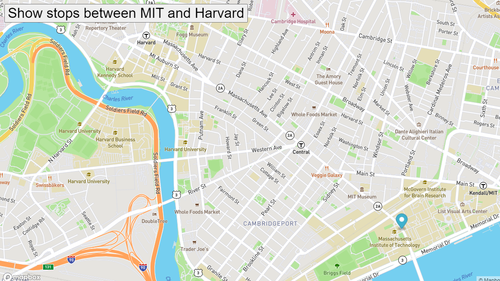

# Bus_Route_Tracker

Eyes is an exercise where a marker moves along the bus stops from MIT campus to Harvard campus.
## How to Run
Make sure to clone Bus_Route_Tracker repo so that index.html, styles.css, and manipulation.js are on your local computer. Next, you can drag index.html into your browser and you should see a map from mapbox appear centered on a set of coordinates dispalying Harvard and MIT campuses in the browser screen.
## Future Improvements
I would like to use different coordinates in my town of Tacoma to track a local bus route I used to take to get to my university. I would use the move function to set markers that stayed on the map and didn't disappear until the user clicked a new button called back. This would erase all markers on the map and return the bus route animation from end back to the beginning. 
## License
MIT License

Copyright (c) 2021, Sam Clark

Permission is hereby granted, free of charge, to any person obtaining a copy
of this software and associated documentation files (the "Software"), to deal
in the Software without restriction, including without limitation the rights
to use, copy, modify, merge, publish, distribute, sublicense, and/or sell
copies of the Software, and to permit persons to whom the Software is
furnished to do so, subject to the following conditions:

The above copyright notice and this permission notice shall be included in all
copies or substantial portions of the Software.

THE SOFTWARE IS PROVIDED "AS IS", WITHOUT WARRANTY OF ANY KIND, EXPRESS OR
IMPLIED, INCLUDING BUT NOT LIMITED TO THE WARRANTIES OF MERCHANTABILITY,
FITNESS FOR A PARTICULAR PURPOSE AND NONINFRINGEMENT. IN NO EVENT SHALL THE
AUTHORS OR COPYRIGHT HOLDERS BE LIABLE FOR ANY CLAIM, DAMAGES OR OTHER
LIABILITY, WHETHER IN AN ACTION OF CONTRACT, TORT OR OTHERWISE, ARISING FROM,
OUT OF OR IN CONNECTION WITH THE SOFTWARE OR THE USE OR OTHER DEALINGS IN THE
SOFTWARE.
